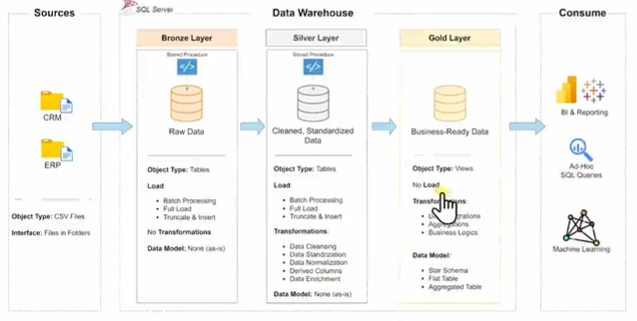
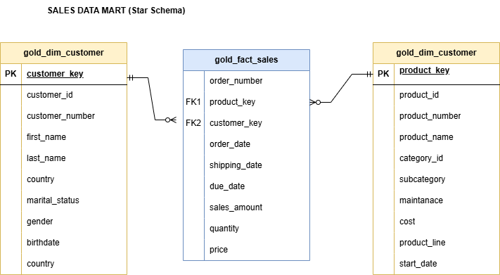
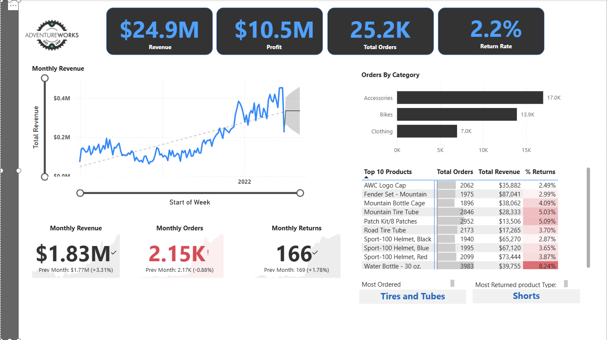

# 💾 SQL Data Warehouse Project  


---

### 📘 Overview  
This project demonstrates a complete **Data Warehousing and Analytics** workflow — from raw data ingestion to actionable insights.  
It’s structured to reflect **industry best practices** in data modeling, ETL automation, and Power BI reporting.  
Designed as a portfolio project to showcase technical depth and practical implementation.

---

### ⚙️ Key Features  
- 🗂️ **Data Sources:** Imports raw data from ERP and CRM CSV files.  
- 🧹 **Data Quality:** Cleanses, validates, and standardizes data across systems.  
- 🔗 **Integration:** Merges ERP and CRM into a unified analytical model.  
- 🧱 **Schema Design:** Implements a simplified Star Schema optimized for BI and performance.  
- 🤖 **Automation:** Stored procedures for consistent, repeatable ETL runs.  
- 📑 **Documentation:** Includes a professional [Data Dictionary](docs/Professional_Data_Dictionary_Gold_Layer.docx).


---

### 🧩 Data Architecture  

The data architecture follows the **Medallion Pattern** — Bronze, Silver, and Gold layers:  





**Explanation:**  
1. **Bronze Layer:** Stores raw data as-is from source systems (ERP & CRM).  
2. **Silver Layer:** Cleansed and standardized data after validation and normalization.  
3. **Gold Layer:** Business-ready data modeled into fact and dimension tables for analytics.  

---

### 🔄 ETL Flow Diagram  

This diagram illustrates the end-to-end ETL process from raw sources to analytical models:  


---

### 📦 Deliverables  
| 📁 Deliverable | 🧾 Description |
|----------------|----------------|
| **SQL Scripts** | ETL scripts for ingestion, transformation, and model creation. |
| **Data Models** | Normalized (3NF) and Denormalized (Star Schema) structures. |
| **Stored Procedures** | Automation for incremental and batch loads. |
| **Analytical Views** | Datasets ready for visualization and KPI tracking. |
| **Power BI Setup** | Predefined data connections and measures. |
| **Documentation** | Includes [Data Dictionary](docs/Professional_Data_Dictionary_Gold_Layer.docx). |


---

### 📁 Project Structure  
| Folder | Purpose |
|---------|----------|
| **datasets/** | Contains ERP and CRM source CSV files. |
| **docs/** | Holds documentation, data dictionary, and diagrams. |
| **scripts/** | SQL scripts for Bronze, Silver, and Gold layers. |
| **tests/** | Data quality and validation scripts. |

---

### 🚀 Quick Start  

1. **Clone the Repository**  
   ```bash
   git clone https://github.com/psa162/sql-data-warehouse-project.git
   cd sql-data-warehouse-project
2. Setup the Database

-- Run to create schema
scripts/database.sql


3. Execute ETL Layers in Order

scripts/bronze/ddl_bronze.sql
scripts/silver/proc_load_silver.sql
scripts/gold/ddl_gold.sql


4. Run Data Quality Checks
Located under /tests/.

5. Connect Power BI
Link Power BI to the Gold Layer for dashboards and KPI visualization.

📊 Analytics & Reporting Goals

This project generates insights into:

👥 Customer behavior and segmentation

🛒 Product performance and profitability

💰 Sales trends and forecasting

These insights enable better business decisions and performance tracking.

📈 Power BI Dashboard

Below is a snapshot of the **final dashboard** built on the Gold Layer model:  



🧰 Technology Stack

🧩 SQL Server / Azure SQL

📈 Power BI

📊 Excel / CSV (Source files)

💡 Why This Project Matters

This project replicates a real-world enterprise data warehouse pipeline.
It demonstrates how to move from raw operational data to structured business insights, applying principles of dimensional modeling, automation, and BI integration.

📜 License

MIT License — free to use, modify, and share with attribution.

👤 Author

Samuel Amoo
Senior Business Analyst & Data Analytics Professional
Focused on building scalable data models and actionable BI insights.
📧 samuelamoo@gmail.com
🔗 LinkedIn Profile
